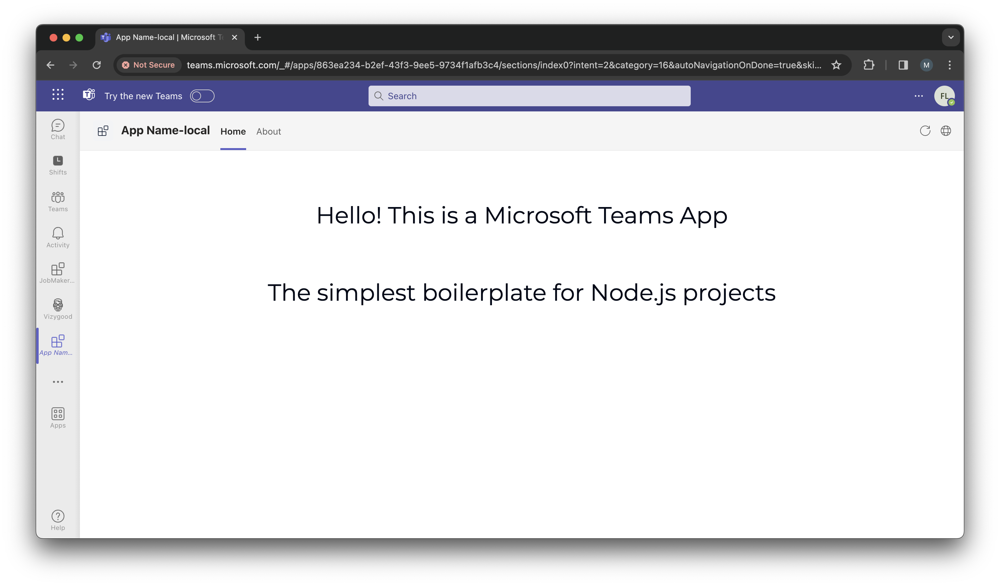
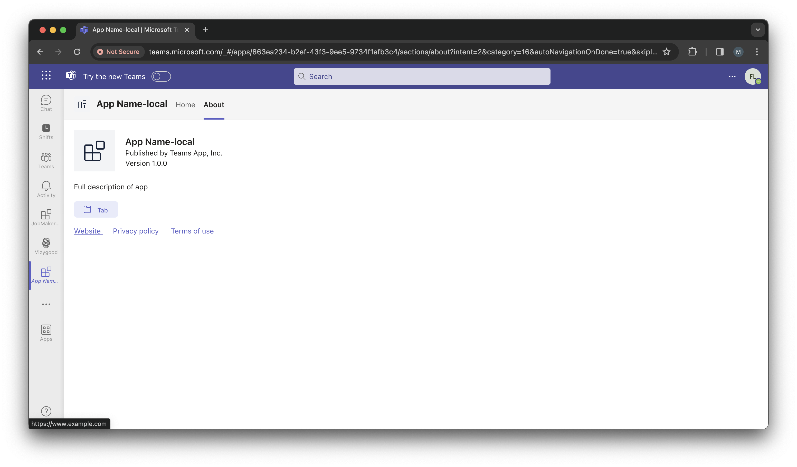
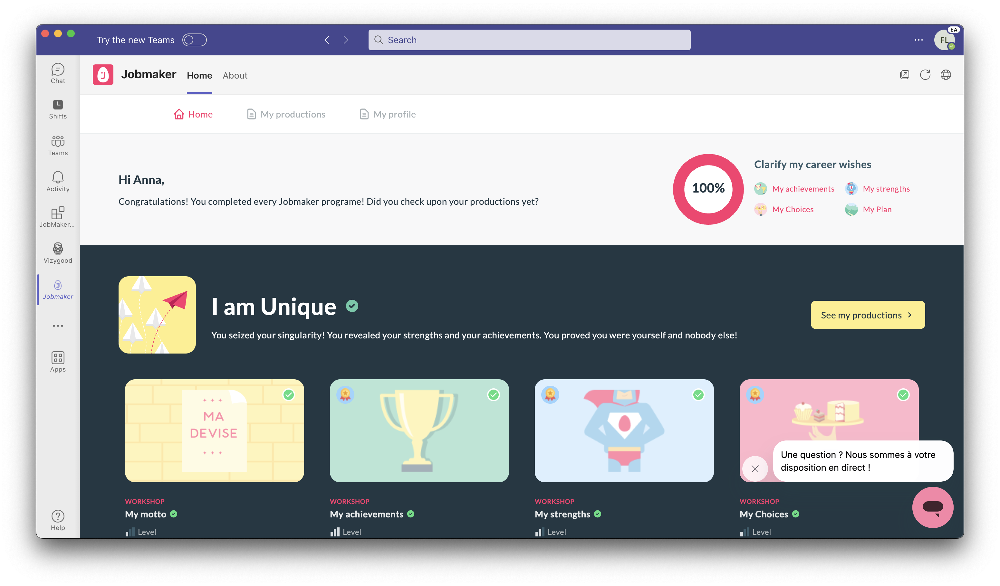
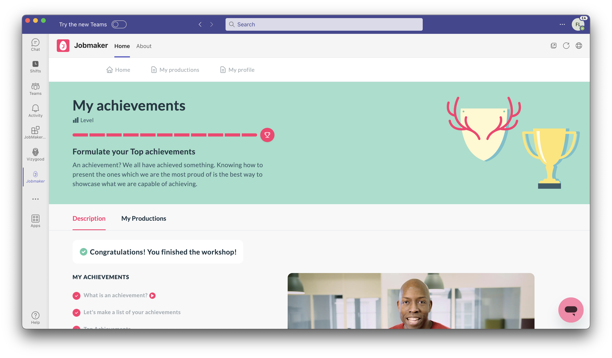

# The Simplest Microsoft Teams App Boilerplate Using Node.js

This document provides instructions for setting up and running a basic Teams App using Node.js.

## Prerequisites

Before you begin, ensure you have the following installed:
- Node.js
- Teams Toolkit extension on your IDE

## Steps to Run the Project Locally

Follow these steps to set up and run each part of the project.

### 1. API Directory

First, set up the API component:

```bash
cd api 
npm i
npm run dev
```


### 2. APP Directory

Next, set up the App component:

```bash
cd app 
npm i
npm run dev
```

### 3. Teams Directory

Finally, set up the Teams component:

```bash
cd teams 
npm i
```

### 4. Start Teams Application

After installing dependencies, open the teams directory on your Visual Studio Code. Go to the Teams Toolkit in your IDE, navigate to **Environment** -> **Local**, and click on **Debug** to start the Teams Application. Click on the link generated on the **Output Console** and there you go!

## Additional Information

For more detailed information about each component, refer to the respective README files in their directories.


### 5. What the Application looks like




# Check our app Jobmaker (digital career coach) on Microsoft App Store created using this template:
[Jobmaker - Microsoft AppSource](https://appsource.microsoft.com/en-us/product/office/WA200006309?tab=Overview)




## Support

If you encounter any issues or have questions, please file an issue in the project's GitHub repository.
